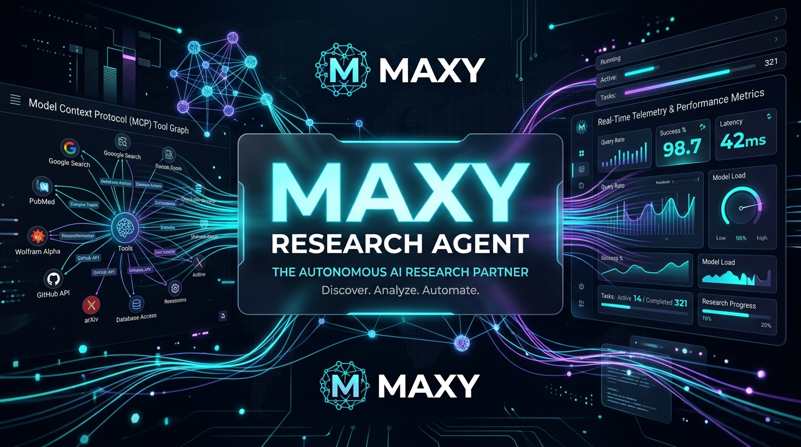
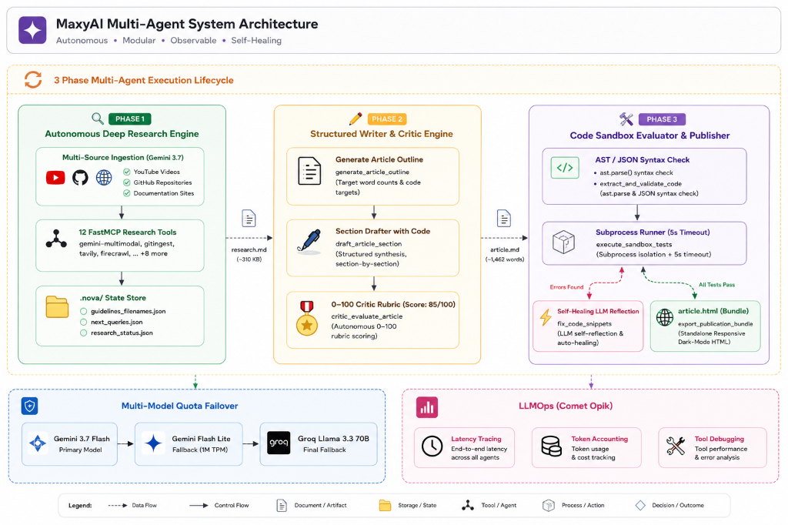
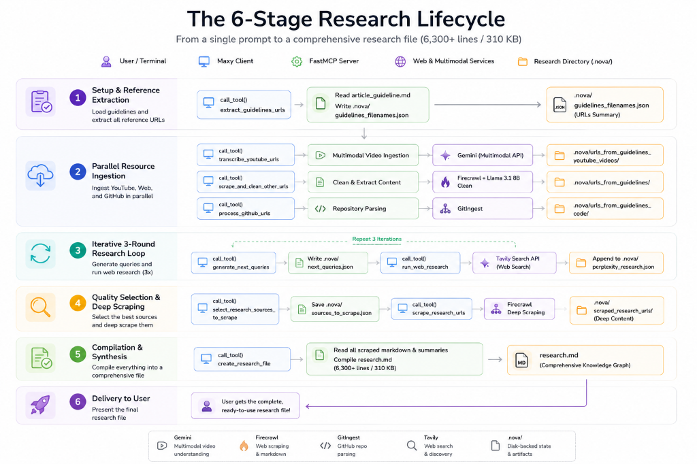
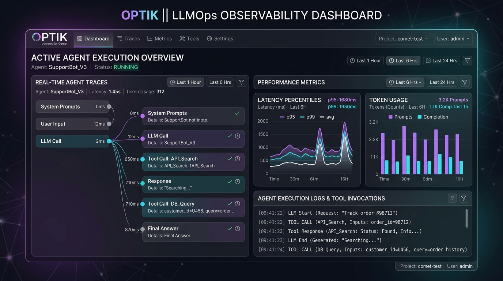

<div align="center">



# 🚀 Maxy Research Agent
### *Autonomous Deep Research & Multi-Modal Synthesis Engine powered by Model Context Protocol (MCP)*

[](https://maxyai-qif1.onrender.com)
[](https://www.python.org/)
[](https://github.com/jlowin/fastmcp)
[](https://ai.google.dev/)
[](https://groq.com/)
[](https://tavily.com/)
[](https://firecrawl.dev/)
[](https://www.comet.com/opik/)
[](https://pytest.org/)
[](https://github.com/)

<br/>

**Maxy** is a production-grade autonomous research agent built on the **Model Context Protocol (MCP)**. It automates end-to-end technical investigations—extracting references from guideline files, transcribing multimodal YouTube videos, ingesting GitHub codebases, executing iterative web research, evaluating source quality, deep-scraping documentation, and synthesizing comprehensive 300+ KB research reports with verified citations.

🔗 **[Live Interactive Web Platform](https://maxyai-qif1.onrender.com)** • [Key Features](#-key-features) • [Architecture](#-architecture) • [Tech Stack & $0 Free Tiers](#-tech-stack--0-free-tier-stack) • [Quick Start](#-quick-start) • [Tools Reference](#-mcp-tools-reference) • [Observability](#-llmops-observability-with-comet-opik)

</div>

---

## 🌟 Key Features

- **🌐 Standard Model Context Protocol (MCP)**: Implemented with `FastMCP` exposing 12 modular research tools, custom prompt workflows, and dynamic data resources.
- **⚡ Dynamic Multi-Model Quota Failover**: Resilient orchestration engine that automatically balances calls across Gemini models (`gemini-3.7-flash` ➔ `gemini-3.6-flash` ➔ `gemini-flash-lite-latest`) and Groq (`llama-3.3-70b` / `llama-3.1-8b`), eliminating 429 quota exhaustion errors.
- **🎥 Multimodal Video Transcription**: Native ingestion and structured transcription of YouTube videos via Gemini multimodal API (e.g. 39-minute lecture processed in under 18s).
- **🐙 GitHub Repository Ingestion**: Deep AST and file-tree extraction of GitHub repositories using `gitingest`.
- **🔄 Iterative Multi-Round Web Discovery**: Autonomous knowledge-gap identification and 3-round query refinement powered by Tavily Search.
- **🕷️ Deep Web Scraping & Markdown Cleaning**: Automated cleaning and formatting of web documentation via Firecrawl.
- **📊 Production LLMOps Telemetry**: End-to-end trace observability, model token usage, tool latency, and error tracking via **Comet Opik** (`project: maxy`).
- **💰 $0 Zero-Budget Optimized**: Engineered from the ground up to operate completely on generous free-tier APIs.

---

## 🏗️ Architecture & System Topology

<div align="center">



</div>

---

## 🔄 The 6-Stage Research Lifecycle

<div align="center">



</div>

---

## 🛠️ Tech Stack & $0 Free-Tier Stack

| Layer | Technology | Free Tier Allocation | Purpose |
| :--- | :--- | :--- | :--- |
| **Orchestrator** | **Google Gemini 3.7 / 3.6 / Flash-Lite** | 1,000,000 TPM | Multi-turn reasoning, tool calling, multimodal audio/video |
| **High-Speed Inference** | **Groq Cloud (Llama 3.3 / 3.1)** | 14,400 Requests/Day | Ultra-fast markdown scraping & JSON structured outputs |
| **Protocol** | **FastMCP (Model Context Protocol)** | Open Source (MIT) | Standardized client-server tool and resource transport |
| **Search Engine** | **Tavily Search API** | 1,000 Queries/Month | Real-time technical web search & source chunking |
| **Alternative Search** | **Puter AI Perplexity** | Free Unlimited | Fallback zero-cost web discovery |
| **Scraping Engine** | **Firecrawl API** | 500 Scraped Pages | High-fidelity HTML-to-clean-Markdown extraction |
| **Code Parser** | **GitIngest** | Open Source | GitHub repository file-tree & AST context ingestion |
| **LLMOps Telemetry** | **Comet Opik** | Free Tier | Real-time trace observability, token & latency telemetry |
| **Environment** | **Python 3.12 + `uv`** | Fast Package Manager | Sub-second virtualenv resolution & deterministic builds |

---

## 📊 LLMOps Observability with Comet Opik

All agent executions, model thought tokens, tool arguments, latency percentiles, and errors are automatically streamed to **Comet Opik**:

<div align="center">



*Live execution trace view showing multi-tool calling sequence, latency percentiles, and token accounting.*

</div>

- **Project Dashboard**: Traces log under project **`maxy`**.
- **Live URL**: [https://www.comet.com/opik/](https://www.comet.com/opik/)
- **Features Tracked**: Latency percentiles (p95/p99), token consumption per turn, tool invocation arguments, and error traces.

---

## 📁 Directory Structure

```
nova_research_agent/
├── data/
│   └── research_function_calling/
│       ├── article_guideline.md              # 📝 Input topic guidelines
│       ├── research.md                       # 📑 Generated 310 KB / 6,318-line report
│       └── .nova/                            # 🔒 Cached pipeline state
│           ├── guidelines_filenames.json     # Extracted reference URLs
│           ├── next_queries.json             # Dynamic search queries
│           ├── perplexity_research.json      # Raw search results
│           ├── sources_to_scrape.json        # Curated top sources
│           ├── urls_from_guidelines/         # Scraped guideline pages
│           ├── urls_from_guidelines_youtube_videos/ # Video transcripts
│           └── scraped_research_urls/        # Deep scraped source texts
├── mcp_server/                               # ⚙️ FastMCP Server Project
│   ├── src/
│   │   ├── app/                              # Domain handlers (scraping, YouTube, GitHub, search)
│   │   ├── routers/                          # MCP Routers (tools, prompts, resources)
│   │   ├── tools/                            # 12 Individual tool implementations
│   │   └── server.py                         # FastMCP Server entry point
│   ├── tests/                                # Pytest test suite (7/7 passing)
│   └── pyproject.toml
├── mcp_client/                               # 🖥️ Interactive MCP Terminal Client
│   ├── src/
│   │   ├── utils/                            # LLM adapters, ReAct loop, Opik tracers
│   │   └── client.py                         # Interactive CLI client
│   └── pyproject.toml
├── docs/assets/                              # 🖼️ Screenshots, architecture diagrams & banner
└── .agents/                                  # 🧠 ECC Guidelines & Agent Customizations
```

---

## 🚀 Quick Start

### 1. Prerequisites
- **Python 3.12+**
- **[`uv`](https://github.com/astral-sh/uv)** package manager:
  ```bash
  curl -LsSf https://astral.sh/uv/install.sh | sh
  ```

### 2. Installation
Install dependencies for both projects with `uv`:

```bash
# Install Server Dependencies
cd mcp_server && uv sync

# Install Client Dependencies
cd ../mcp_client && uv sync
```

### 3. Configure API Keys
Create `.env` files in both `mcp_server/` and `mcp_client/`:

```bash
# === Zero-Budget LLM Configuration ===
GOOGLE_API_KEY=your_gemini_api_key_here
GROQ_API_KEY=your_groq_api_key_here

# === Web Search & Scraping ===
WEB_SEARCH_PROVIDER=tavily
TAVILY_API_KEY=your_tavily_api_key_here
FIRECRAWL_API_KEY=your_firecrawl_api_key_here

# === Observability (Optional) ===
OPIK_API_KEY=your_opik_api_key_here
OPIK_PROJECT_NAME=maxy
```

### 4. Run the Interactive Client or Web Dashboard

#### Option A: Interactive Web Dashboard (UI)
* **Live Cloud Deployment**: [https://maxyai-qif1.onrender.com](https://maxyai-qif1.onrender.com)
* **Run Locally**:
  ```bash
  cd mcp_server
  uv run python -m uvicorn web.server:app --app-dir /home/mack/Music/paul/nova_research_agent --host 127.0.0.1 --port 8501
  ```
  Open `http://127.0.0.1:8501` in your browser.

#### Option B: Interactive Terminal CLI
Launch the terminal client:
```bash
cd mcp_client
uv run python -m src.client
```

1. **Load Prompt**:
   ```text
   /prompt/full_research_instructions_prompt
   ```
2. **Provide Research Target**:
   ```text
   The research folder is /home/mack/Music/paul/nova_research_agent/data/research_function_calling. Run the complete workflow from start to finish.
   ```

---

## 🧰 MCP Tools Reference

The **Maxy FastMCP Server** exposes 21 specialized tools across 3 lifecycle phases:

| Tool Name | Parameters | Lifecycle Phase | Description |
| :--- | :--- | :--- | :--- |
| `extract_guidelines_urls` | `research_directory` | Phase 1 (Research) | Parses `article_guideline.md` into GitHub, YouTube, web, and local file references. |
| `process_local_files` | `research_directory` | Phase 1 (Research) | Copies and sanitizes local code/markdown files referenced in guidelines. |
| `scrape_and_clean_other_urls` | `research_directory` | Phase 1 (Research) | Scrapes guideline web links with Firecrawl and formats markdown via LLM. |
| `process_github_urls` | `research_directory` | Phase 1 (Research) | Ingests GitHub repositories and Jupyter notebooks via `gitingest`. |
| `transcribe_youtube_urls` | `research_directory` | Phase 1 (Research) | Multimodal video-to-markdown transcription using Gemini audio/video API. |
| `generate_next_queries` | `research_directory` | Phase 1 (Research) | Analyzes knowledge gaps and produces targeted search queries with justifications. |
| `run_web_research` | `research_directory`, `queries` | Phase 1 (Research) | Executes multi-query web search via Tavily Search API or Puter Perplexity. |
| `select_research_sources_to_scrape`| `research_directory` | Phase 1 (Research) | LLM evaluation and scoring to filter high-quality research URLs. |
| `scrape_research_urls` | `research_directory` | Phase 1 (Research) | Scrapes and stores full-text articles from selected research sources. |
| `create_research_file` | `research_directory` | Phase 1 (Research) | Aggregates all scraped content, transcripts, and notes into `research.md`. |
| `run_perplexity_research` | `research_directory`, `queries` | Phase 1 (Research) | Direct Perplexity search provider handler. |
| `select_research_sources_to_keep` | `research_directory` | Phase 1 (Research) | Curates final research citations. |
| `read_research_summary` | `research_directory` | Phase 2 (Writing) | Extracts structured metadata, character count, and cited URLs from `research.md`. |
| `generate_article_outline` | `research_directory` | Phase 2 (Writing) | Generates a structured multi-section technical outline with code targets. |
| `draft_article_section` | `research_directory`, `section_title`, `key_points`, `include_code` | Phase 2 (Writing) | Drafts a comprehensive technical section with runnable code examples. |
| `critic_evaluate_article` | `research_directory`, `article_content` | Phase 2 (Writing) | Performs autonomous peer review, scoring quality (0-100) and finding flaws. |
| `refine_and_save_article` | `research_directory`, `article_content`, `critic_feedback` | Phase 2 (Writing) | Refines formatting, adds TOC, and saves publication `article.md`. |
| `extract_and_validate_code` | `research_directory` | Phase 3 (Publishing) | Parses all code blocks in `article.md`, validates AST syntax, and saves to `.nova/sandbox/`. |
| `execute_sandbox_tests` | `research_directory` | Phase 3 (Publishing) | Executes Python snippets in an isolated subprocess runner with timeout protection. |
| `fix_code_snippets` | `research_directory`, `broken_code`, `error_message` | Phase 3 (Publishing) | Automatically repairs broken code snippets using self-healing LLM reflection. |
| `export_publication_bundle` | `research_directory`, `article_title` | Phase 3 (Publishing) | Compiles verified article into standalone, responsive dark-mode HTML (`article.html`). |

---

## 🧪 Testing & Verification

Run the automated test suite in `mcp_server`:

```bash
cd mcp_server
uv run pytest
```

```text
============================= test session starts ==============================
platform linux -- Python 3.12.11, pytest-8.4.2
rootdir: /home/mack/Music/paul/nova_research_agent/mcp_server
plugins: langsmith-0.4.26, anyio-4.10.0, opik-1.9.15
collected 19 items

tests/test_builder.py ........                                           [ 42%]
tests/test_web_search.py .......                                         [ 78%]
tests/test_writer.py ....                                                [100%]

============================== 19 passed in 2.83s ==============================
```

---

## 📜 License & Credits

Distributed under the **MIT License**.

- **Built with**: [FastMCP](https://github.com/jlowin/fastmcp), [Google GenAI SDK](https://github.com/google-gemini/generative-ai-python), [Groq Cloud](https://groq.com), [Tavily](https://tavily.com), [Firecrawl](https://firecrawl.dev), and [Comet Opik](https://www.comet.com/opik/).
- **Engineered using**: The **ECC (Everything Claude Code / Agent Harness System)** framework for deterministic agent reliability.
