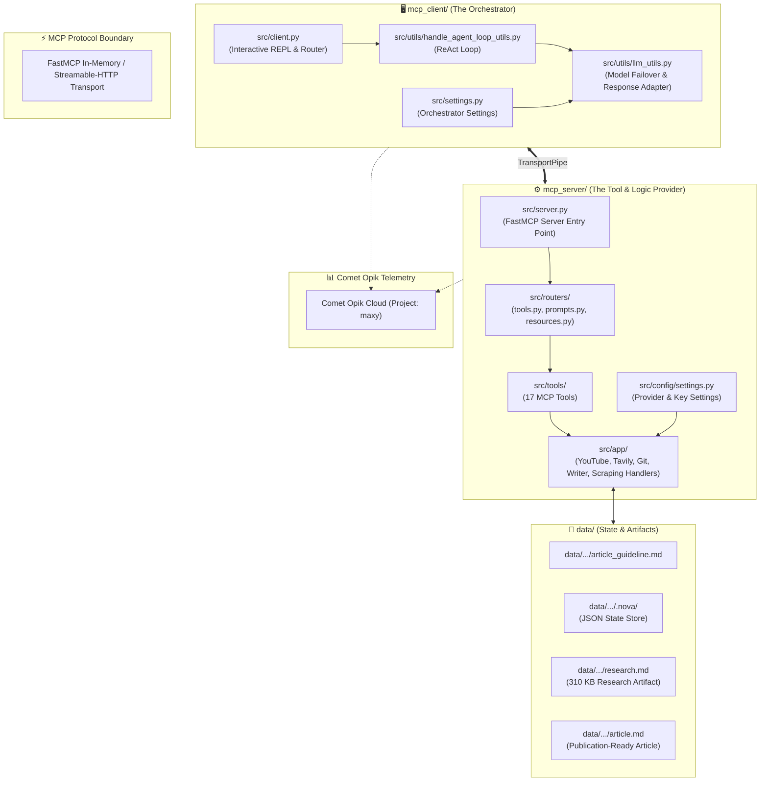

# 🧭 Maxy Codebase Architecture: File-by-File Technical Guide & Dependency Map

> **Purpose:** Comprehensive engineering guide explaining the responsibility, importance, internal mechanics, and cross-file connections of every file in the Maxy repository.  
> **Use Case:** Codebase onboarding, architecture reviews, and technical interview preparation.

---

## 🗺️ 1. High-Level Directory Topology & System Boundaries

The codebase is structured into two decoupled, modular subsystems communicating over the **Model Context Protocol (MCP)**, plus a shared data and agent-memory layer:

```
nova_research_agent/
├── 📁 mcp_server/       # FastMCP Server exposing 17 tools, prompts & resources
├── 📁 mcp_client/       # Interactive Terminal Client & ReAct Failover Orchestrator
├── 📁 data/             # Input objectives, compiled research & publication articles
├── 📁 docs/             # Technical case studies, architecture diagrams & assets
└── 📁 .agents/          # ECC persistent rules, invariant guards & workflow skills
```

---

## 🔗 2. Subsystem Connection & Data-Flow Graph



---

## 📂 3. File-by-File Breakdown & Architectural Analysis

---

### 🖥️ `mcp_client/` — The Reasoning & Orchestration Layer

The client acts as the autonomous "brain" that receives user intent, plans multi-step tool calls, handles model rate limits, and renders rich terminal output.

| File Path | Core Purpose | Importance & Connections |
| :--- | :--- | :--- |
| **`src/client.py`** | Main CLI REPL entry point. | Boots the interactive shell using `prompt_toolkit`. Intercepts slash commands (`/tools`, `/prompts`, `/prompt/<name>`, `/resources`). Initializes in-memory FastMCP client transport to communicate with `mcp_server`. |
| **`src/settings.py`** | Pydantic configuration for client LLMs. | Loads client `.env`. Configures default orchestrator model (`gemini-3.7-flash`), temperature, recursion limits, and thinking token budgets. Validates parameter exclusivity. |
| **`src/utils/llm_utils.py`** | Dynamic failover engine & response adapter. | **CRITICAL FILE.** Implements `OpenAIResponseAdapter` (intercepts malformed XML tool tags from open-source models) and the **Dynamic Multi-Model Failover Engine** (cascades across 4 Gemini tiers down to Groq on HTTP 429 quota exhaustion). |
| **`src/utils/handle_agent_loop_utils.py`** | ReAct execution loop. | Drives the multi-turn agent loop: sends conversation history to the LLM, parses tool calls, invokes the MCP server tools, and streams model thoughts/tool results to the console. |
| **`src/utils/cli_utils.py`** | Terminal UI & formatting. | Formats markdown, colored status badges, tool execution spinners, and error alerts using `rich.console`. |
| **`src/utils/opik_utils.py`** | Client telemetry dispatcher. | Injects Opik session and thread IDs into client-side model invocations for centralized trace aggregation. |
| **`.env` / `.env.example`** | Client API credentials. | Supplies `GOOGLE_API_KEY`, `GROQ_API_KEY`, `OPIK_API_KEY`, and `OPIK_PROJECT_NAME=maxy`. |
| **`pyproject.toml`** | Client package dependencies. | Defines Python 3.12 requirements (`fastmcp`, `langchain-google-genai`, `langchain-groq`, `opik`, `rich`, `prompt_toolkit`). |

---

### ⚙️ `mcp_server/` — The Tool Execution & Business Logic Layer

The server exposes 17 specialized tools, prompt workflows, and data access points conforming to the Model Context Protocol.

#### 1. Server Core & Configuration
| File Path | Core Purpose | Importance & Connections |
| :--- | :--- | :--- |
| **`src/server.py`** | FastMCP server entry point. | Instantiates `create_mcp_server()`, registers all routers (tools, prompts, resources), sets `GIT_TERMINAL_PROMPT="0"` to prevent headless hangs, and exposes stdio or streamable-HTTP transport. |
| **`src/config/settings.py`** | Server-wide Pydantic settings. | Centralized configuration for all API keys (Gemini, Groq, Tavily, Firecrawl, Puter, GitHub, Opik) and model assignments per task (e.g. YouTube transcription model vs scraping model). |
| **`src/config/constants.py`** | Fixed string & path constants. | Defines standardized file names (`article_guideline.md`, `research.md`, `article.md`, `.nova/` directory names). |

#### 2. Domain Handlers (`src/app/`)
These files contain the pure business logic decoupled from MCP routing.

| File Path | Core Purpose | Importance & Connections |
| :--- | :--- | :--- |
| **`src/app/youtube_handler.py`** | Multimodal YouTube transcription. | Calls Google GenAI SDK (`aio.models.generate_content`) to natively transcribe YouTube video URLs into structured markdown notes in under 18 seconds. |
| **`src/app/github_handler.py`** | GitHub repository ingestion. | Uses `gitingest` to parse repository directory structures, AST codebases, and Jupyter notebooks into clean markdown. |
| **`src/app/web_search_handler.py`** | Search provider dispatcher. | Routes search requests to Tavily, Perplexity, or Puter AI based on `WEB_SEARCH_PROVIDER` configuration. |
| **`src/app/tavily_handler.py`** | Tavily search integration. | Executes real-time multi-query web search, extracts source chunks, and normalizes citations into indexed references. |
| **`src/app/firecrawl_handler.py`** | Deep web scraping. | Uses Firecrawl API to extract high-fidelity clean markdown from documentation URLs. |
| **`src/app/query_generation_handler.py`** | Knowledge-gap analysis. | Uses fast LLM inference (Groq Llama 3.1 8B) to analyze current research coverage and produce targeted search queries. |
| **`src/app/source_selection_handler.py`** | Search result curation. | Uses LLM scoring heuristics to select the most authoritative URLs for deep scraping. |
| **`src/app/writer_handler.py`** | Article generation & peer review. | Defines Pydantic schemas (`ArticleOutline`, `CriticEvaluation`), generates outlines, drafts technical sections with code, and calculates critic quality scores (0–100). |
| **`src/app/perplexity_handler.py`** | Perplexity API caller. | Direct Perplexity API client integration. |
| **`src/app/puter_handler.py`** | Puter AI unlimited proxy. | Zero-cost unlimited Perplexity proxy via Puter AI API. |

#### 3. MCP Routers & Tools (`src/routers/` & `src/tools/`)
| File Path | Core Purpose | Importance & Connections |
| :--- | :--- | :--- |
| **`src/routers/tools.py`** | MCP Tool registration. | Exposes all 17 tools via `@mcp.tool()` and wraps every tool call with `@opik.track(type="tool")` for automated observability. |
| **`src/routers/prompts.py`** | MCP Prompt registration. | Exposes `/prompt/full_research_instructions_prompt` and `/prompt/full_writer_instructions_prompt`. |
| **`src/routers/resources.py`** | MCP Resource registration. | Exposes dynamic read-only URI resources (e.g. `nova://research/{topic}`) to inspect disk state. |
| **`src/tools/writer_tools.py`** | 5 FastMCP Writer tools. | Implements `read_research_summary`, `generate_article_outline`, `draft_article_section`, `critic_evaluate_article`, and `refine_and_save_article`. |
| **`src/tools/run_web_research_tool.py`** | Web search tool. | Handles multi-query search dispatch and appends results to `.nova/perplexity_research.json`. |
| **`src/tools/create_research_file_tool.py`** | Research aggregation tool. | Combines all scraped pages, code summaries, and video transcripts into `research.md`. |
| **`src/tools/extract_guidelines_urls_tool.py`** | URL extractor tool. | Parses `article_guideline.md` into classified URLs. |

#### 4. Shared Utilities & Testing (`src/utils/` & `tests/`)
| File Path | Core Purpose | Importance & Connections |
| :--- | :--- | :--- |
| **`src/utils/file_utils.py`** | Safe file system I/O. | Implements `read_file_safe()`, `validate_research_folder()`, and directory tree builders. |
| **`src/utils/llm_utils.py`** | Server LLM factory. | Returns structured or standard ChatModels (`get_chat_model`) configured with LangChain OpenAI/Gemini/Groq adapters. |
| **`src/utils/markdown_utils.py`** | Markdown formatting utilities. | Builds collapsible `<details>` blocks, headers, and Table of Contents strings. |
| **`src/utils/opik_utils.py`** | Server-side Opik tracking. | Manages server thread tracking and provides fallback mock wrappers when Opik is disabled. |
| **`tests/test_web_search.py`** | Web search unit tests. | Tests Tavily result normalization, source ranking, and provider dispatch (7 tests). |
| **`tests/test_writer.py`** | Writer & Critic unit tests. | Tests Pydantic schemas, metadata extraction, async tool handlers, and file publishing (4 tests). |

---

### 📁 `data/` — The Persistent State & Research Data Store

The `data/` directory contains both human-authored inputs and autonomous agent outputs:

| File / Folder Path | Responsibility & Content |
| :--- | :--- |
| **`data/research_function_calling/article_guideline.md`** | **Human Input**: Editorial objectives, target audience, core questions to answer, YouTube links, and GitHub URLs. |
| **`data/research_function_calling/research.md`** | **Phase 1 Output**: 310 KB / 6,318-line compiled knowledge base with all transcripts, code snippets, and scraped articles. |
| **`data/research_function_calling/article.md`** | **Phase 2 Output**: 1,462-word, publication-ready technical article complete with code examples, TOC, and citations. |
| **`data/research_function_calling/.nova/`** | **State Machine Cache**: Contains intermediate JSON states (`guidelines_filenames.json`, `next_queries.json`, `sources_to_scrape.json`, `article_outline.json`, `critic_evaluation.json`) and raw scraped folders. |

---

### 🧠 `.agents/` — Antigravity & ECC Memory Layer

| File Path | Responsibility |
| :--- | :--- |
| **`AGENTS.md`** | Workspace-wide engineering invariants: $0 budget defaults, test-driven validation, fail-safe dispatch. |
| **`.agents/rules/01-ecc-core-principles.md`** | Antigravity execution rules: anti-placeholder validation, deterministic ReAct cycles. |
| **`.agents/skills/nova-research-workflow/SKILL.md`** | Operational cheat sheet for running, configuring, and extending the Maxy agent. |

---

## 🏆 4. Summary of Key Architectural Strengths to Mention in Interviews

1. **Decoupled Client-Server Topology**: Logic is split across FastMCP server tools and client orchestrators, enabling the server to run locally in-memory or as a remote HTTP microservice.
2. **Deterministic Artifact-Driven State Transfer**: Agents communicate through structured files in `.nova/` and Pydantic validation rather than stuffing hundreds of thousands of tokens into conversation memory.
3. **Zero-Budget Resilience Engine**: High-volume structured reasoning is assigned to fast Groq models (14.4k req/day), multimodal audio/video to Gemini (1M TPM), and 429 quota exhaustion is resolved seamlessly via multi-model failover.
4. **End-to-End Observability**: Comet Opik tracks every single tool turn, latency percentile, and token expenditure for production monitoring.
