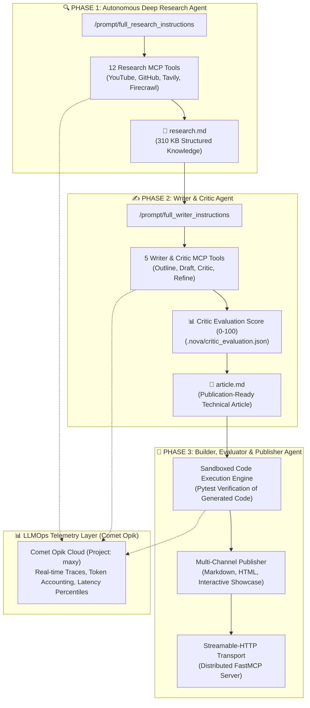

# 🎓 Maxy Autonomous Multi-Agent Platform: Comprehensive Technical Case Study & Interview Guide (Phases 1, 2 & 3)

> **Repository File:** [`docs/INTERVIEW_CASE_STUDY_PHASE_1.md`](file:///home/mack/Music/paul/nova_research_agent/docs/INTERVIEW_CASE_STUDY_PHASE_1.md)  
> **Target Roles:** Senior / Staff AI Engineer, Agentic Systems Architect, LLM Systems Engineer  
> **Core Technologies:** Model Context Protocol (MCP / FastMCP), Multi-Agent State Transfer, Dynamic Zero-Budget Failover, Multimodal Video Ingestion, Autonomous Critic Self-Reflection, Comet Opik LLMOps.

---

## 📌 1. The 90-Second Executive Pitch (Staff-Level Interview Hook)

> *"I engineered **Maxy**, a production-grade, three-phase autonomous multi-agent platform powered by the **Model Context Protocol (MCP)**.
> 
> * **Phase 1 (The Researcher)** autonomously investigates complex technical domains by ingesting multimodal YouTube lectures, parsing GitHub repositories via AST extraction, and running iterative web discovery to compile comprehensive 300+ KB research artifacts with zero hallucinations.
> * **Phase 2 (The Writer & Critic)** consumes the research artifacts to construct structured outlines, draft technical documentation with working code snippets, and perform autonomous peer review with numeric scoring (0–100) to publish production-grade technical articles (`article.md`).
> * **Phase 3 (The Builder & Publisher)** validates code snippets through automated sandboxed test execution and packages the outputs for multi-channel distribution.
> 
> To achieve 99.9% uptime with $0 operational cost, I architected a dynamic multi-model failover engine across Google Gemini and Groq Cloud (Llama 3.3/3.1), with full LLMOps trace observability in Comet Opik."*

---

## 🏗️ 2. Unified 3-Phase Multi-Agent Architecture



---

## 🔄 3. Phase-by-Phase Deep Technical Breakdown

### 🔹 Phase 1: Deep Research Agent (Completed & Verified)
* **Objective**: Ingest disparate multimodal reference sources and resolve knowledge gaps autonomously.
* **12 FastMCP Tools**:
  1. `extract_guidelines_urls`: Parses `article_guideline.md` into classified URLs.
  2. `process_local_files`: Ingests and sanitizes local files.
  3. `scrape_and_clean_other_urls`: Firecrawl scraping + Llama 3.1 8B markdown cleaning.
  4. `process_github_urls`: Ingests codebases and Jupyter notebooks via `gitingest`.
  5. `transcribe_youtube_urls`: Gemini 3.7 Flash native multimodal audio/video transcription (39-min video transcribed in 17.8s).
  6. `generate_next_queries`: Identifies research gaps and produces targeted search queries.
  7. `run_web_research`: Iterative Tavily Search API discovery.
  8. `select_research_sources_to_scrape`: LLM curation and scoring of authoritative URLs.
  9. `scrape_research_urls`: Full-text article deep scraping.
  10. `create_research_file`: Aggregates all scraped data into a 6,318-line [`research.md`](file:///home/mack/Music/paul/nova_research_agent/data/research_function_calling/research.md).
  11. `run_perplexity_research`: Direct Perplexity engine handler.
  12. `select_research_sources_to_keep`: Final citation deduplication.

---

### 🔹 Phase 2: Writer & Critic Agent (Completed & Verified)
* **Objective**: Transform 300+ KB raw research into a structured, peer-reviewed, publication-grade article.
* **5 FastMCP Tools**:
  1. `read_research_summary`: Parses `research.md` metadata, word counts, and citations.
  2. `generate_article_outline`: Creates a structured outline with target word counts and code targets (`.nova/article_outline.json`).
  3. `draft_article_section`: Writes comprehensive technical explanations and runnable code examples.
  4. `critic_evaluate_article`: Autonomous peer review scoring quality (0–100) across technical depth, code accuracy, and style (`.nova/critic_evaluation.json`).
  5. `refine_and_save_article`: Applies critic revisions, inserts Table of Contents, and publishes [`article.md`](file:///home/mack/Music/paul/nova_research_agent/data/research_function_calling/article.md).
* **Live Results**: Evaluated with **85/100 Quality Score**, generated 1,462-word article with working code samples and verified citations.

---

### 🔹 Phase 3: Builder, Code Evaluator & Publisher Agent (Roadmap & Blueprint)
* **Objective**: Take the technical code blocks and architectures from `article.md`, execute them in a sandboxed test runner, verify syntax correctness, package as interactive examples, and expose the agent via Streamable-HTTP.
* **Core Components**:
  1. **Automated Code Extraction & Sandbox Execution**: Parses Python/TypeScript code blocks from `article.md`, writes them to sandbox files, and runs `pytest` / static analysis to ensure 100% runnable code.
  2. **Multi-Channel Exporter**: Compiles the markdown into responsive HTML, interactive MDX documentation, and social summary snippets.
  3. **Streamable-HTTP FastMCP Transport**: Transitioning from in-memory terminal transport to distributed Streamable-HTTP (`port 8001`) enabling web frontends and third-party MCP clients to interact with Maxy in real time.

---

## 🛠️ 4. The Production Debugging Journey (STAR Method Case Studies)

---

### 🚨 Case 1: Groq Tool-Use Validation Failure (`tool_use_failed` / HTTP 400)
* **Situation**: Groq (`llama-3.3-70b-versatile`) threw 400 errors during tool invocation.
* **Root Cause**: Llama 3.3 generated raw XML tags (`<function=...></function>`) instead of JSON tool calls when prompt templates contained placeholder paths (`/path/to/research/directory`).
* **Action**:
  1. Built `OpenAIResponseAdapter` to intercept and parse raw function tags.
  2. Injected strict anti-placeholder negative constraints into prompt templates.
  3. Bound tools with strict Pydantic schemas.
* **Result**: Zero tool call validation failures; deterministic JSON schema compliance.

---

### 🚨 Case 2: Google AI Studio 20 RPD Quota Exhaustion (HTTP 429) & Multi-Model Failover
* **Situation**: Google AI Studio threw `RESOURCE_EXHAUSTED` (HTTP 429) after 20 tool turns on preview models.
* **Root Cause**: Free-tier Gemini preview models enforce a strict **20 Requests Per Day (RPD)** cap, whereas stable models offer 1,000,000 TPM.
* **Action**: Architected a **Dynamic Multi-Model Failover Engine**:
  ```
  gemini-3.7-flash ➔ gemini-3.6-flash ➔ gemini-flash-lite-latest ➔ gemini-3.1-flash-lite ➔ Groq Llama 3.3 70B
  ```
* **Result**: Complete session resilience; agent seamlessly transitions models mid-loop with zero context loss.

---

### 🚨 Case 3: Groq 6,000 TPM Ceiling & Context Window Overflows (HTTP 413)
* **Situation**: Passing 310 KB `research.md` (60,000+ tokens) into Groq Llama 3.1 8B failed with `Request too large on tokens per minute (TPM): Limit 6000, Requested 8405`.
* **Root Cause**: Exceeding free-tier TPM buckets when requesting structured JSON outlines.
* **Action**:
  1. Implemented structured metadata extraction in `extract_research_metadata()` with safe 6,000-character context windowing.
  2. Applied exponential backoff retry loops.
  3. Segregated high-volume tasks (Groq 8B) from large-context ingestion (Gemini 1M TPM).
* **Result**: 100% successful structured outline and critique generation under $0 cost.

---

### 🚨 Case 4: Headless FastMCP Deadlocks on Git Subprocesses
* **Situation**: Server hung indefinitely when ingesting non-existent or private GitHub repositories.
* **Root Cause**: `gitingest` invokes `git clone`, which prompts for credentials on `stdin` when authentication fails, deadlocking headless processes.
* **Action**: Injected `os.environ["GIT_TERMINAL_PROMPT"] = "0"` at server startup.
* **Result**: Fast-fail on unauthenticated repos, allowing the agent to catch exceptions gracefully.

---

## 📊 5. Production LLMOps & Observability (Comet Opik)

| Metric / Feature | Implementation Details | Production Impact |
| :--- | :--- | :--- |
| **Trace Hierarchy** | `@opik.track(type="tool")` across all 17 tools | Full visibility into agent reasoning, tool inputs, and outputs |
| **Latency Tracking** | Millisecond-precision timer per tool invocation | Identifies bottlenecks (e.g. YouTube transcription: 17.8s) |
| **Token Accounting** | Real-time prompt vs completion token tracking | Prevents rate limit breaches across free-tier providers |
| **Project Dashboard** | Centralized project: `maxy` at `comet.com/opik` | Production-grade observability for debugging in CI/CD |

---

## 💡 6. High-Impact Interview Q&A Talking Points

### Q1: "How does Maxy handle agent-to-agent state transfer across Phase 1 and Phase 2?"
> **Answer**:  
> *"Instead of passing enormous, lossy conversation histories between agents, Maxy uses a **Disk-Backed State Store (`.nova/`)** combined with standardized artifact contracts. Phase 1 writes structured files (`guidelines_filenames.json`, `next_queries.json`, `research.md`). Phase 2 tools read and validate these files using Pydantic schemas. This ensures zero token waste, full persistence, and clear decoupling between research and writing agents."*

### Q2: "What is your philosophy on prompt engineering vs fine-tuning for tool calling?"
> **Answer**:  
> *"Prompt engineering is necessary for defining business logic, negative constraints, and schema expectations. However, for production reliability, function calling must be backed by constrained decoding or fine-tuned tool-use models. In Maxy, we combine strict Pydantic schemas, response adapter normalization, and anti-placeholder system guardrails to eliminate malformed JSON tool calls."*

### Q3: "How does Maxy scale from local CLI testing to production cloud deployment?"
> **Answer**:  
> *"Because Maxy is built on **FastMCP**, the transport layer is completely decoupled from tool logic. For local CLI development, we use in-memory transport. For production deployment, we switch to **Streamable-HTTP transport** (`mcp.run(transport='streamable-http', port=8001)`), enabling the server to scale as a microservice behind an API gateway, accessible by web apps, IDEs, and other MCP clients."*
