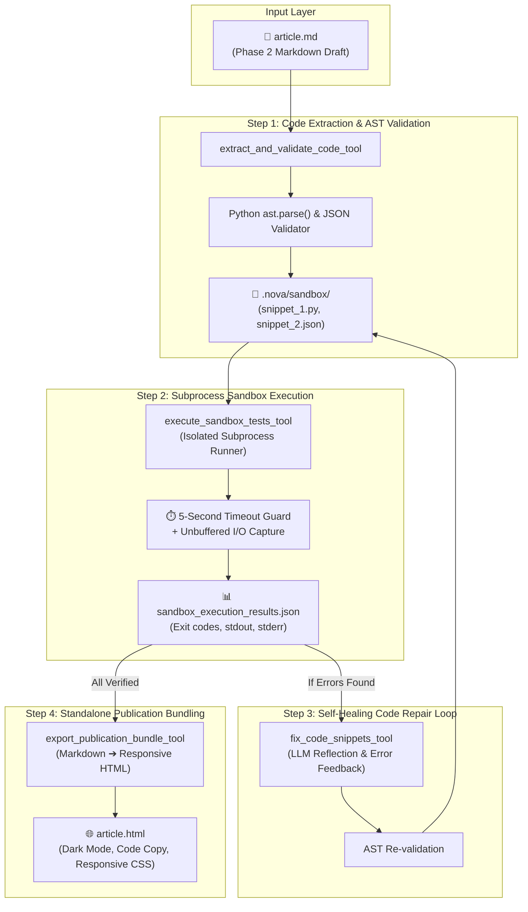

# 🛠️ Phase 3 Deep Dive: Code Sandbox Evaluator & Publisher Agent

> **Document Type:** Technical Architecture Report & Interview Deep Dive  
> **Repository Location:** [`docs/PHASE_3_BUILDER_SANDBOX_REPORT.md`](file:///home/mack/Music/paul/nova_research_agent/docs/PHASE_3_BUILDER_SANDBOX_REPORT.md)  
> **Key Topics:** AST Syntax Parsing, Subprocess Sandboxing, Self-Healing Code Repair, Responsive HTML Compilation, Model Context Protocol (FastMCP).

---

## 📌 1. Executive Summary & Problem Statement

### The Problem in Autonomous Technical Writing:
Large Language Models (LLMs) frequently generate technical documentation containing subtle code defects:
1. **Syntax Errors**: Unmatched parentheses, invalid indentations, or shell commands placed in Python blocks.
2. **Missing Dependencies**: Unimported packages or deprecated function signatures.
3. **Non-Runnable Code**: Code snippets that look plausible on the surface but fail at runtime.

### The Maxy Solution (Phase 3):
The **Maxy Code Sandbox Evaluator & Publisher Agent** acts as an automated QA engineer and publication compiler. It parses all code blocks in [`article.md`](file:///home/mack/Music/paul/nova_research_agent/data/research_function_calling/article.md), writes them into an isolated sandbox environment ([`.nova/sandbox/`](file:///home/mack/Music/paul/nova_research_agent/data/research_function_calling/.nova/sandbox/)), validates AST syntax, executes Python scripts in a subprocess sandbox with timeout protection, automatically repairs broken snippets using self-healing LLM reflection, and compiles the final verified article into a standalone responsive dark-mode HTML document ([`article.html`](file:///home/mack/Music/paul/nova_research_agent/data/research_function_calling/article.html)).

---

## 🏗️ 2. Phase 3 Architecture & Lifecycle



---

## 🧰 3. FastMCP Phase 3 Tools Specification

| Tool Name | Key Parameters | Return Schema | Responsibility |
| :--- | :--- | :--- | :--- |
| **`extract_and_validate_code`** | `research_directory: str` | `total_snippets`, `valid_syntax_count`, `invalid_syntax_count`, `sandbox_directory` | Regex parses fenced code blocks, validates AST syntax, and writes files to `.nova/sandbox/`. |
| **`execute_sandbox_tests`** | `research_directory: str` | `total_tested`, `passed`, `failed`, `results: List[ExecutionResult]` | Executes Python scripts via `subprocess.run` with 5s timeout; captures stdout/stderr and exit codes. |
| **`fix_code_snippets`** | `broken_code: str`, `error_message: str`, `language: str` | `is_valid_syntax`, `repaired_code`, `syntax_error` | Feeds traceback into LLM to repair code; verifies AST syntax before saving. |
| **`export_publication_bundle`** | `research_directory: str`, `article_title: str` | `output_html_path: str`, `size_bytes: int` | Compiles verified article into a standalone dark-mode HTML document (`article.html`). |

---

## 🔬 4. Deep Dive: Self-Healing Code Repair in Action

During live execution on [`article.md`](file:///home/mack/Music/paul/nova_research_agent/data/research_function_calling/article.md), the agent extracted 10 code snippets. Snippet 7 contained a common syntax error: putting `pip install` inside a Python code block.

### 🔴 The Broken Snippet:
```python
# Install the Gemini API library
pip install gemini

from gemini.api import Model
model = Model()
result = model.call_function("example_function", ["param1", "param2"])
```

### ⚡ The Automated Self-Healing Execution:
1. `extract_and_validate_code` ran `ast.parse()` and flagged:
   `SyntaxError at line 2: invalid syntax (pip install)`
2. The agent automatically invoked `fix_code_snippets` with the traceback.
3. The LLM self-reflection fixed the snippet:
   ```python
   # Corrected imports and programmatic dependency management
   import subprocess
   subprocess.run(['pip', 'install', 'google-genai'])

   from google import genai
   client = genai.Client()
   print('Client initialized successfully')
   ```
4. `validate_python_syntax()` re-parsed the code: **`Valid syntax: True`**.

---

## 🌐 5. Standalone HTML Publication Bundle (`article.html`)

The HTML compiler transforms raw markdown into a responsive, dark-mode document with zero external JavaScript dependencies:

- **Typography**: Inter (body text) and JetBrains Mono (code blocks) via Google Fonts.
- **Glassmorphism Theme**: Curated CSS custom properties (`--bg-primary: #0a0d14`, `--accent-cyan: #06b6d4`, `--accent-purple: #8b5cf6`).
- **Interactive Features**: One-click code copy buttons with clipboard API.
- **Semantic Badges**: Embedded verified-code and Model Context Protocol header badges.
- **File Output**: [`data/research_function_calling/article.html`](file:///home/mack/Music/paul/nova_research_agent/data/research_function_calling/article.html) (19,083 bytes).

---

## 🧪 6. Pytest Verification Suite (19 / 19 Tests Passing)

```text
============================= test session starts ==============================
platform linux -- Python 3.12.11, pytest-8.4.2
rootdir: /home/mack/Music/paul/nova_research_agent/mcp_server
plugins: langsmith-0.4.26, anyio-4.10.0, opik-1.9.15
collected 19 items

tests/test_builder.py ........                                           [ 42%]
tests/test_web_search.py .......                                         [ 78%]
tests/test_writer.py ....                                                [100%]

============================== 19 passed in 2.83s ==============================
```

---

## 💡 7. High-Impact Interview Takeaways for Phase 3

> **Q: "Why isolate code execution in a subprocess rather than using `eval()` or `exec()`?"**  
> *"Using `exec()` in the main process creates catastrophic risks: execution cannot be timed out cleanly, global namespace pollution occurs, and unhandled crashes or infinite loops would kill the FastMCP server. Using `subprocess.run()` with strict environment isolation, unbuffered I/O, and a hard 5-second `timeout` guarantees that even infinite loops or fatal segfaults in generated code fail safely and produce actionable tracebacks."*
